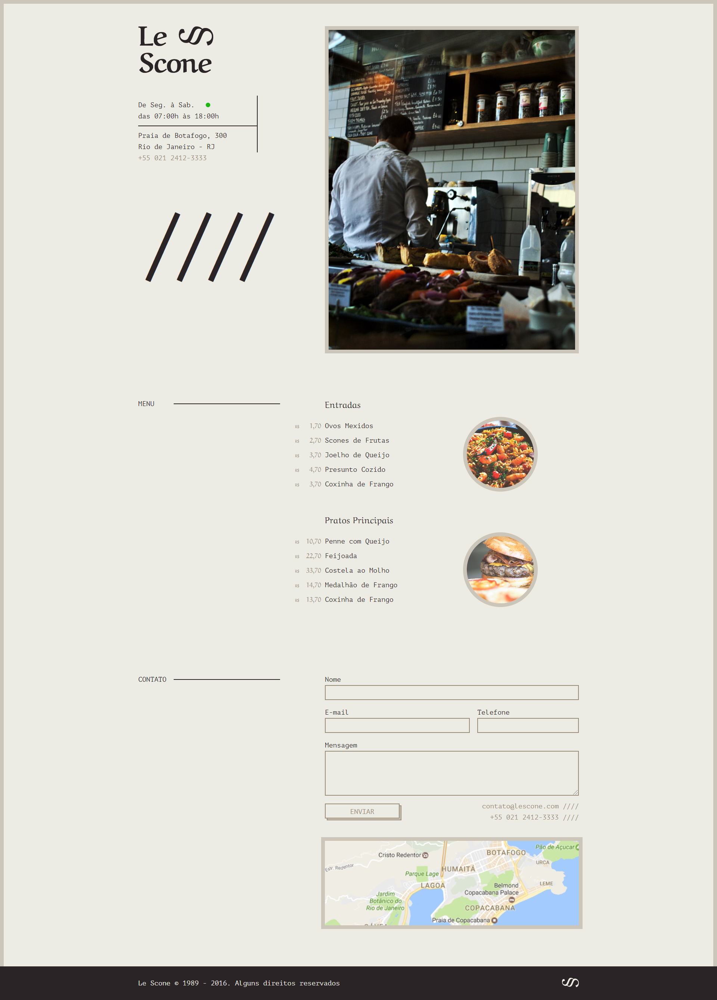

<h1 align="center">
  LeScone
</h1>

<p align="center">
  <a href="#projeto">Projeto</a>&nbsp;&nbsp;&nbsp;|&nbsp;&nbsp;&nbsp;
  <a href="#stacks">Stacks</a>&nbsp;&nbsp;&nbsp;|&nbsp;&nbsp;&nbsp;
  <a href="#layout">Layout</a>&nbsp;&nbsp;&nbsp;|&nbsp;&nbsp;&nbsp;
  <a href="#instalação">Instalação</a>&nbsp;&nbsp;&nbsp;|&nbsp;&nbsp;&nbsp;
  <a href="#contributing">Contributing</a>&nbsp;&nbsp;&nbsp;|&nbsp;&nbsp;&nbsp;
  <a href="#license">Licença</a>
</p>

<br>

## Projeto

> Projeto desenvolvido pelo Curso de Sass Origamid.

## Stacks

Esse projeto foi construido com Angular 10.0.1, com a finalizade de usar as tecnicas do [Sass](https://sass-lang.com/):

- Variáveis
- Nesting
- Mixins
- Extend
- Operadores
- Condicionais
- Funções
- Loop

## Layout



## Instalação

```

Frontend: http://localhost:4200

```sh
cd frontend/
npm install
npm start
```


## Contributing

1. Faça o _fork_ do projeto (<https://github.com/gabrieljony/semana-omnistack-11/fork>)
2. Crie uma _branch_ para sua modificação (`git checkout -b feature/fooBar`)
3. Faça o _commit_ (`git commit -am 'Add some fooBar'`)
4. _Push_ (`git push origin feature/fooBar`)
5. Crie um novo _Pull Request_

## License

Esse projeto está sob a licença MIT. Veja o arquivo [LICENSE](LICENSE.md) para mais detalhes.

---

<h4 align="center">
    Desenvolvido por <a href="https://www.linkedin.com/in/gabriel-jony/">Gabriel Jony</a>
</h4>
